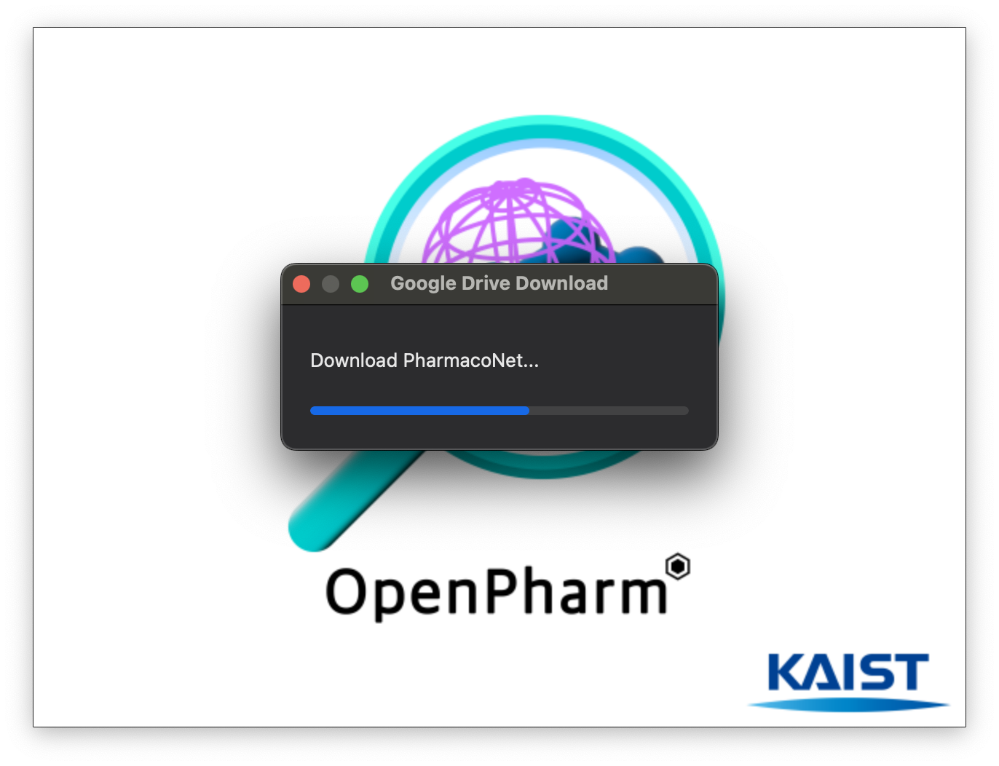
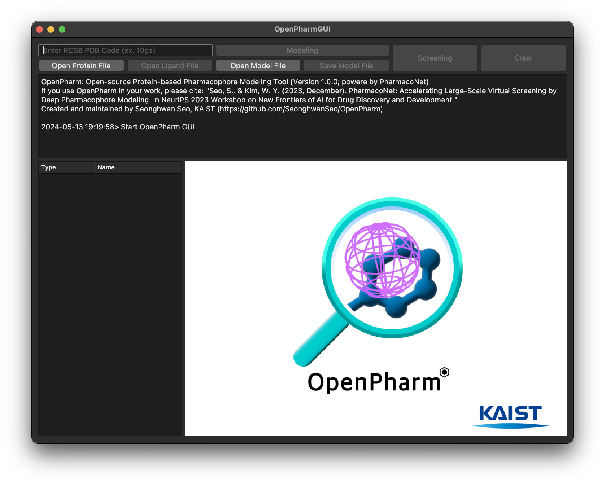
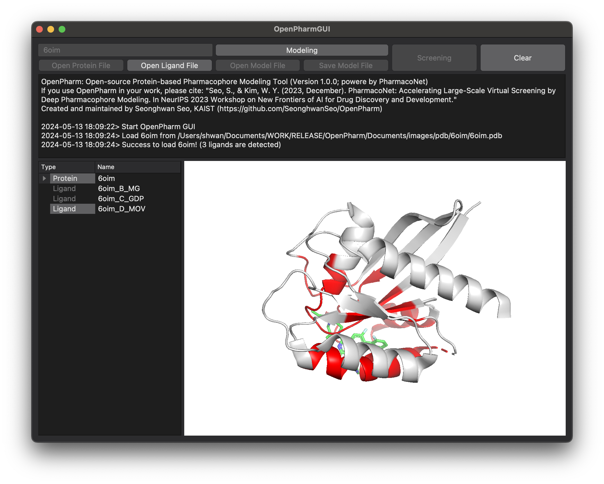
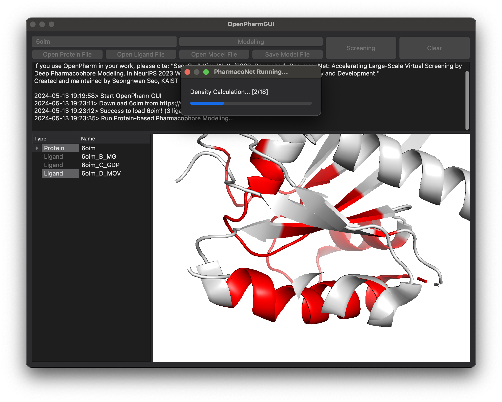
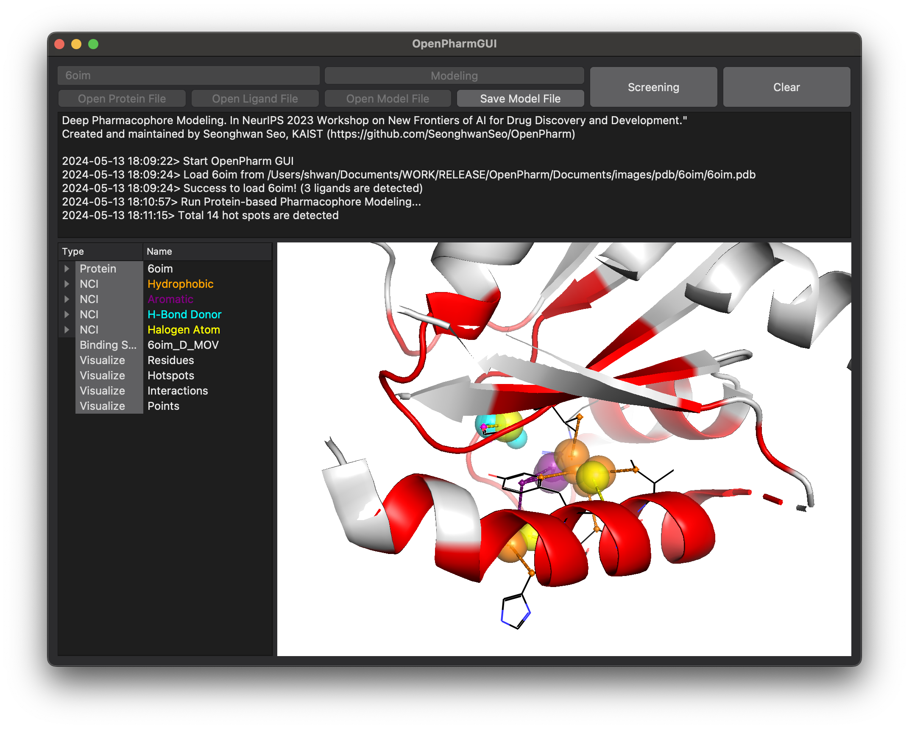
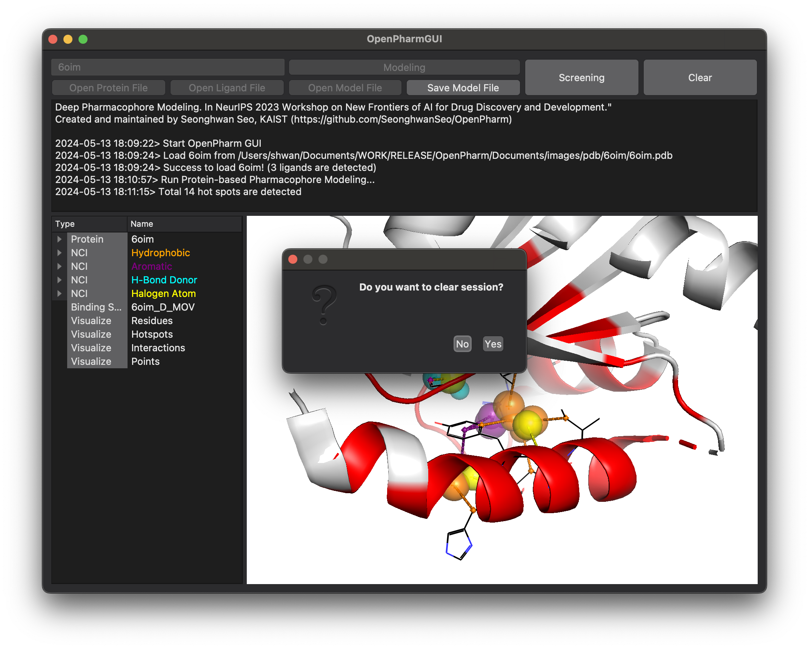
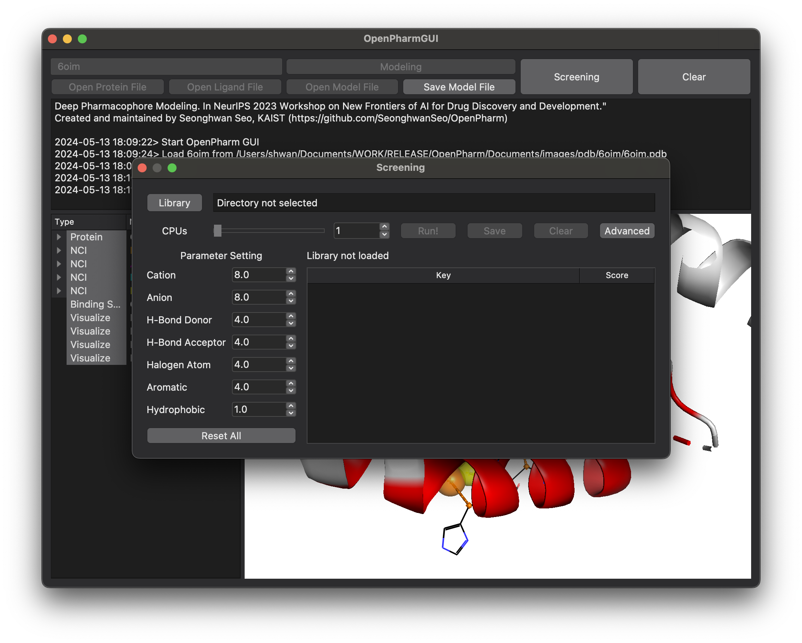
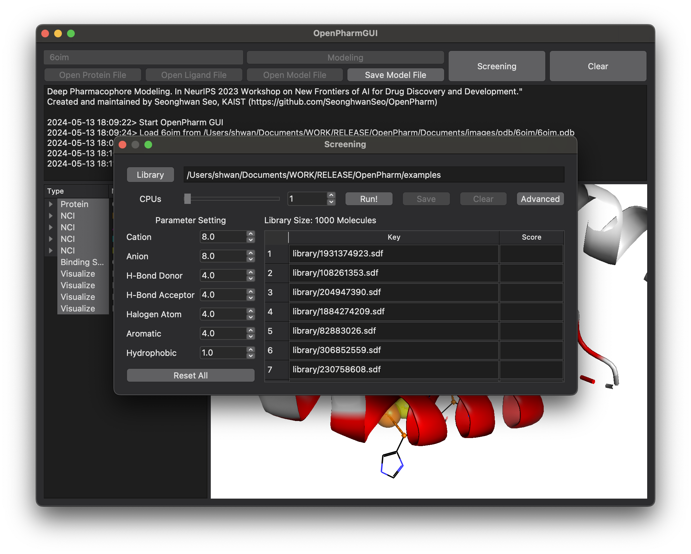
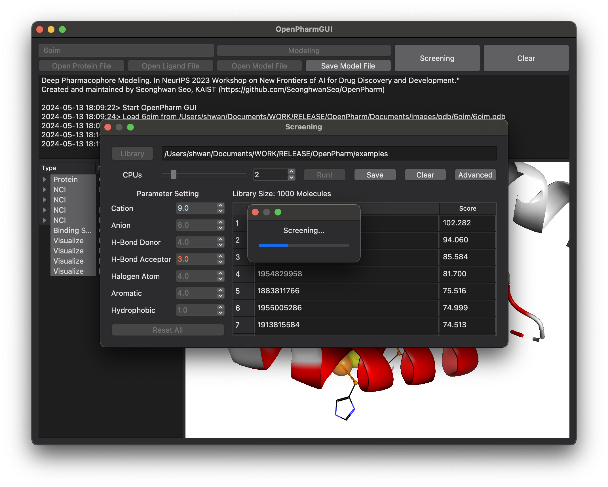
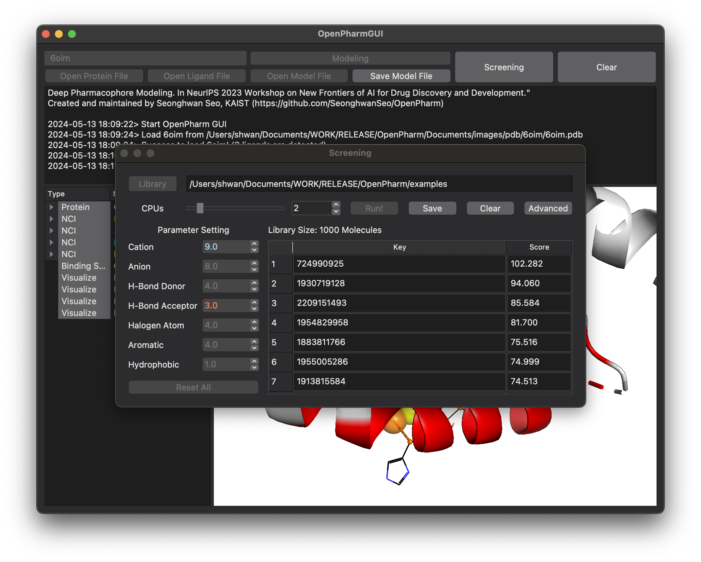

# OpenPharm Manual (한글)


OpenPharm은 딥러닝을 통해 완전히 자동화된 단백질 기반 파마코포어 모델링 및 초고속 가상 스크리닝을 수행하는 PharmacoNet의 그래픽 사용자 인터페이스를 지원합니다.

개발 및 유지보수: 서성환 (카이스트 화학과 김우연 교수 연구실)

OpenPharm을 사용하실 경우, 아래 논문을 인용해주세요:

> Seo, S., & Kim, W. Y. (2023, December). PharmacoNet: Accelerating Large-Scale Virtual Screening by Deep Pharmacophore Modeling. In NeurIPS 2023 Workshop on New Frontiers of AI for Drug Discovery and Development.

논문: https://arxiv.org/abs/2310.00681

소스 코드: https://github.com/SeonghwanSeo/OpenPharm


## 1. 시작

### 1-1. 설치

Github으로부터 소스코드를 다운받은 뒤, Anaconda 가상환경을 통해 필요한 라이브러리를 설치합니다.

```bash
# Install Project
git clone https://github.com/SeonghwanSeo/OpenPharm
cd OpenPharm

# Install conda environment
conda env create -f environment.yml
conda activate openpharm
pip install .
```

### 1-2. 실행

이제 아래와 같이 openpharm 명령어를 통해 OpenPharm을 실행시킬 수 있습니다.

```bash
conda activate openpharm  # (re-activate to load alias)
openpharm
```

OpenPharm을 처음으로 실행시키면 초기 세팅 과정이 수행되며, 필요한 파일들을 다운받습니다. (139 MB)



모든 다운로드를 마치면, 이후 실행에서는 약 2초 정도의 로딩 시간이 소요됩니다.



## 2. 단백질-기반 파마코포어 모델링 (Protein-based Pharmacophore Modeling)

### 2-1. 단백질 및 결합 부위 지정하기

OpenPharm은 RCSB로부터 단백질 파일을 다운받고, 자동으로 파싱하여 결합부위를 인식합니다.

`Enter RCSB PDB Code`에 4자리 PDB Code을 입력하세요.

만일 RCSB가 아닌 별도의 단백질을 사용하고자 하는 경우, 수기로 `Open Protein File`을 통해 단백질(`pdb`)을 입력하고, `Open Ligand File`을 통해 결합 리간드(`mol2, sdf`)를 입력하여 결합 부위를 인식하도록 합니다.

Protein 옆의 화살표를 눌러 chain, stick, line 등 단백질 구조를 시각화할 수 있습니다.



### 2-2. 파마코포어 모델링

왼쪽 테이블에서 원하는 결합 부위 리간드를 선택하고, `Modeling` 버튼을 눌러 단백질 기반 파마코포어 모델링을 수행합니다.





### 2-3. 파마코포어 모델 저장하기 (Ctrl-S/Cmd-S)

계산된 파마코포어 모델은 `Save Model File`을 클릭하여 저장할 수 있습니다. (`.pm` 확장자)

### 2-4. 파마코포어 모델 불러오기 (Ctrl-O/Cmd-O)

저장된 파마코포어 모델은 `Open Model File`을 누르거나 파일을 프로그램 창으로 드래그앤드롭하여 로드할 수 있습니다.

이 때, `Open Model File`을 누르기 위해서는 세션을 초기화해야 합니다 (`Clear`)

### 2-5. 세션 초기화 (Ctrl-W/Cmd-W)

단백질 또는 파마코포어 모델을 닫고 새로운 작업을 하기 위해 `Clear` 버튼을 눌러 세션을 초기화합니다.




## 3. 초고속 가상스크리닝

파마코포어 모델이 열려있는 상태에서 `Screening` 버튼을 눌러 스크리닝을 수행할 수 있습니다.



### 3-1. 화합물 라이브러리 불러오기

`Library` 버튼을 눌러 폴더를 선택하거나 혹은 스크리닝 창으로 드래그앤드롭하면, 폴더 및 하위 폴더 내에 있는 모든 `sdf` 및 `mol2` 파일이 로드됩니다. (각 화합물 파일에는 1개 이상의 컨포머가 포함될 수 있습니다.)

예를 들어, 아래 `library/` 폴더를 선택하는 경우 `a.mol2`, `b.mol2`, `c.mol2`,  `d.sdf`, `d.mol2`, `e.sdf` 파일이 모두 로드됩니다.

```bash
├── library/
    ├── a.mol2
    ├── library1/
    │   ├── b.mol2
    │   └── library1_1/
    │       ├── c.mol2
    │       └── d.sdf
    └── library2/
        ├── d.mol2
        └── e.sdf
```

아래는 8개의 컨포머를 포함하는 1000개 화합물로 구성된 예제 라이브러리 (https://drive.google.com/file/d/1XCMv97WpfgEccR4xXTGep_PCMMJq3f7t/view?usp=share_link)을 열었을 때의 화면입니다.


이 때, `Advanced` 버튼을 눌러 분자를 파싱하는 규칙을 파일명(`File Name`) 혹은 파일경로(`File Path`) 중 하나로 선택할 수 있습니다. (기본값: `File Name`)

예를 들어, 위 `d.sdf`와 `d.mol2`의 경우 동일한 파일명을 가지고 있어 구분이 되지 않지만, 파일경로를 선택한 경우 구분이 가능합니다.

아래는 파일 경로를 선택하였을 때의 화면입니다.



### 3-2. 가중치 설정

OpenPharm의 내장 프로그램인 PharmacoNet은 7개의 약리학적 특성에 할당되는 파라미터를 통해 스크리닝을 수행하며, OpenPharm을 통해 각 약리학적 특성에 대한 가중치를 변경할 수 있습니다.

`Parameter Setting` 아래의 값을 마우스 또는 키보드를 통해 변경할 수 있으며, 기본값보다 높게 설정된 경우 파란색, 낮게 설정된 경우 빨간색으로 표시됩니다.

초기값으로 바꾸고 싶은 경우, `Reset All` 버튼을 누릅니다.


### 3-3. 가상 스크리닝 수행

모든 설정이 끝났으면, 사용할 CPU 코어의 개수를 `CPUs` 옆의 슬라이드 바 혹은 숫자를 변경하여 설정합니다.

OpenPharm은 시스템에 있는 CPU를 자동으로 인식하여 최대값을 지정합니다.

설정 후 `Run`  버튼을 누르면 스크리닝이 진행되고, 가장 높은 점수의 분자부터 나열됩니다.





### 3-4. 결과 저장

`Save` 버튼을 누르면 스크리닝 결과가 저장됩니다.

이 때 Key는 설정값(`File Name` 또는 `File Path`)에 의해 결정됩니다.

### 3-5. 세션 초기화

다른 라이브러리 혹은 세팅값으로 스크리닝을 수행하고 싶은 경우, `Clear` 버튼을 눌러 세션을 초기화합니다.


## 4. 개발

OpenPharm은 PyTorch, NumPy, Numba, BioPython, OpenBabel, Open-Source PyMol, PyQt5을 활용하여 개발되었습니다.


## 5. 인용

논문: https://arxiv.org/abs/2310.00681

OpenPharm을 사용하실 경우, 아래 논문을 인용해주세요:

> Seo, S., & Kim, W. Y. (2023, December). PharmacoNet: Accelerating Large-Scale Virtual Screening by Deep Pharmacophore Modeling. In NeurIPS 2023 Workshop on New Frontiers of AI for Drug Discovery and Development.


## 6. 저작권

```
MIT License

Copyright (c) 2023 Seonghwan Seo

Permission is hereby granted, free of charge, to any person obtaining a copy
of this software and associated documentation files (the "Software"), to deal
in the Software without restriction, including without limitation the rights
to use, copy, modify, merge, publish, distribute, sublicense, and/or sell
copies of the Software, and to permit persons to whom the Software is
furnished to do so, subject to the following conditions:

The above copyright notice and this permission notice shall be included in all
copies or substantial portions of the Software.

THE SOFTWARE IS PROVIDED "AS IS", WITHOUT WARRANTY OF ANY KIND, EXPRESS OR
IMPLIED, INCLUDING BUT NOT LIMITED TO THE WARRANTIES OF MERCHANTABILITY,
FITNESS FOR A PARTICULAR PURPOSE AND NONINFRINGEMENT. IN NO EVENT SHALL THE
AUTHORS OR COPYRIGHT HOLDERS BE LIABLE FOR ANY CLAIM, DAMAGES OR OTHER
LIABILITY, WHETHER IN AN ACTION OF CONTRACT, TORT OR OTHERWISE, ARISING FROM,
OUT OF OR IN CONNECTION WITH THE SOFTWARE OR THE USE OR OTHER DEALINGS IN THE
SOFTWARE.
```

