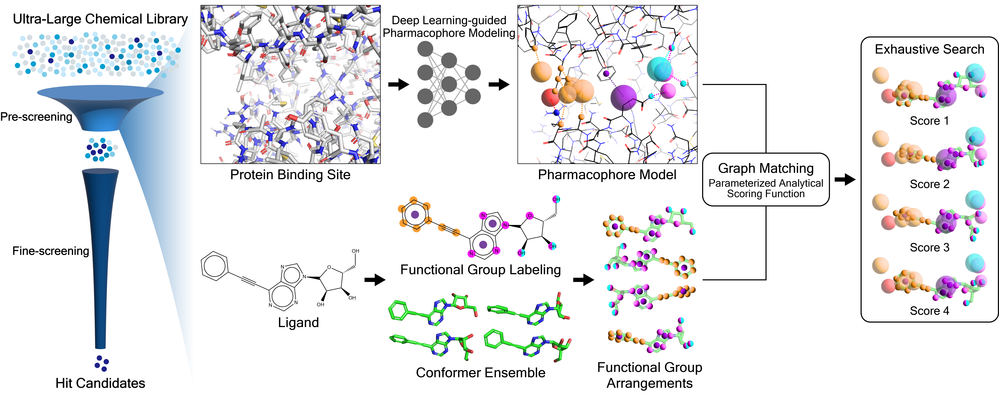

# OpenPharmaco: Open-source Protein-based Pharmacophore Modeling Software



Open-Source software for Fully-automated Protein-based Pharmacophore Modeling and High-throughput Virtual Screening.

OpenPharmaco is currently powered by **_PharmacoNet: deep learning-guided pharmacophore modeling for ultra-large-scale virtual screening_**, developed by Seonghwan Seo, KAIST.

If you are deep learning researcher, please visit PharmacoNet [[github](https://github.com/SeonghwanSeo/PharmacoNet)]. It provides more functions.

If you have any problems or need help, please add an github issue.

You can get more information at [Wiki](https://github.com/SeonghwanSeo/OpenPharmaco/wiki).

\* Tested on Microsoft Window and Mac OS X (Apple Silicon).

## Quick Start

```bash
# Download Source Codes
git clone https://github.com/SeonghwanSeo/OpenPharmaco.git

# Create Environment
cd OpenPharmaco/
conda env create -f environment.yml
conda activate openph
pip install .

# Start
conda activate openph
openph # or openpharmaco
```

## Citation

Paper on [Chemical Science](https://doi.org/10.1039/D4SC04854G), [arXiv](https://arxiv.org/abs/2310.00681).

```bibtex
@article{seo2024pharmaconet,
  title={PharmacoNet: deep learning-guided pharmacophore modeling for ultra-large-scale virtual screening},
  author={Seo, Seonghwan and Kim, Woo Youn},
  journal={Chemical Science},
  year={2024},
  publisher={Royal Society of Chemistry}
}
```

## Future Plan

- Version 2.0.0
  - Performance Improvement (Provisional: PharmacoNet v2)
  - SMILES Input (Conformer-free inference)
- Verison 2.1.0:
  - Binding Site Detection for Apo Protein Structures
  - Pharmacophore Customizing
- Version 3
  - Binding Pose Prediction

## Reference

- [PyTorch](https://pytorch.org)
- [NumPy](https://numpy.org)
- [Biopython](http://biopython.org)
- [Open Babel](http://openbabel.org)
- [Open-Source PyMOL](http://pymol.org) ([github](https://github.com/schrodinger/pymol-open-source))
- [PyQt5](https://www.riverbankcomputing.com/software/pyqt/)
